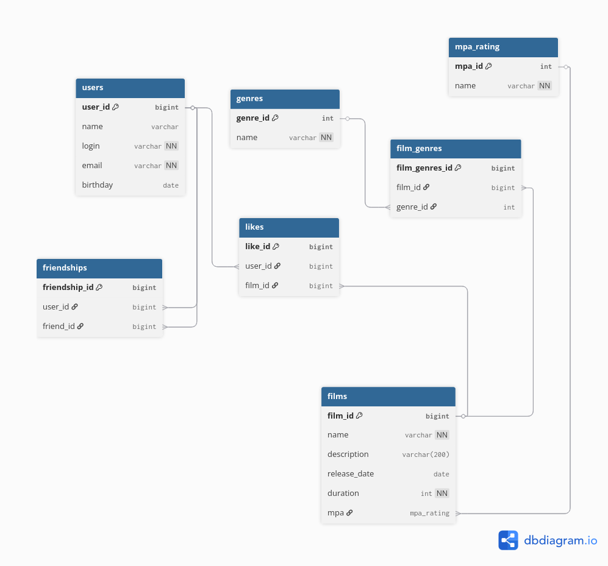

# Filmorate

Filmorate is an application for managing movies and users, implementing basic social network features for movie enthusiasts. Users can add friends, like films, and view top-rated movies based on likes.

## Database Schema

The database schema represents the structure of the application data in **Third Normal Form (3NF)**. It includes tables for users, films, genres, friendships, likes, and the association between films and genres.



**Key points of the schema:**

- `users` — stores all registered users.
- `films` — stores information about films, including genres and MPA ratings.
- `friendships` — represents friendship relationships with a `status` field (enum: REQUESTED, CONFIRMED).
- `likes` — stores which users liked which films.
- `film_genres` — many-to-many relation between films and genres.

## Example SQL Queries

### Get all users
```sql
SELECT * FROM users;
```

### Get all films
```sql
SELECT * FROM films;
```

### Get top 10 most liked films
```sql
SELECT f.*,
       COUNT(l.user_id) AS likes_count
FROM films f
LEFT JOIN likes l ON f.film_id = l.film_id
GROUP BY f.film_id
ORDER BY likes_count DESC
LIMIT 10;
```

### Get common friends between two users
```sql
SELECT u.*
FROM users u
JOIN friendships f1 
    ON u.user_id = f1.friend_id 
    AND f1.user_id = 1 
    AND f1.status = 'CONFIRMED'
JOIN friendships f2 
    ON u.user_id = f2.friend_id 
    AND f2.user_id = 2 
    AND f2.status = 'CONFIRMED';
```

### Get films liked by a specific user
```sql
SELECT f.*
FROM films f
JOIN likes l ON f.film_id = l.film_id
WHERE l.user_id = 1;
```

## Notes

- All relationships are normalized according to the 3rd Normal Form (3NF).
- Enum fields are used for `friendship.status` and `film.mpa_rating`.
- Many-to-many relationships (films ↔ genres, users ↔ friends) are represented via separate join tables.	
